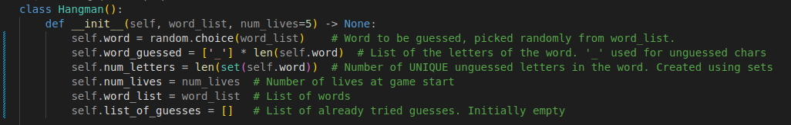
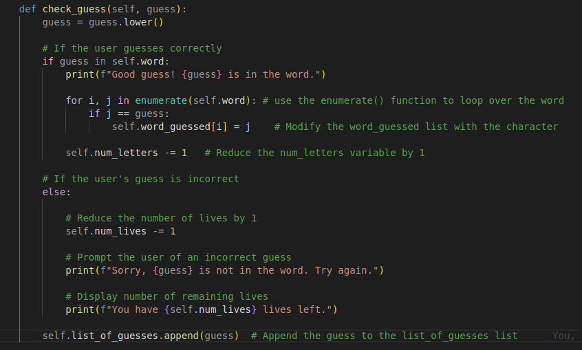
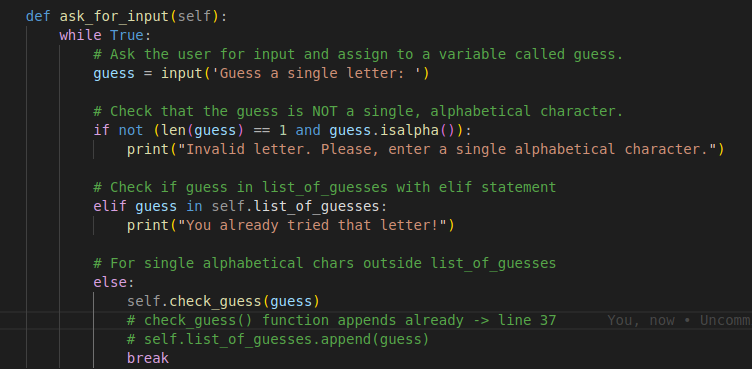
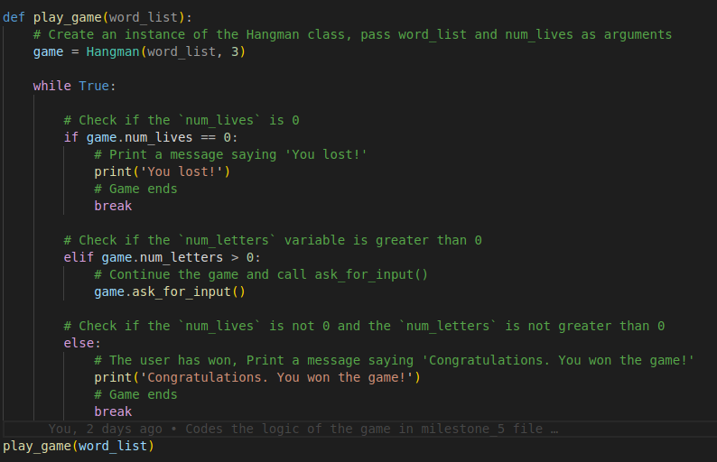

# Hangman
Hangman is a classic game in which a player thinks of a word and the other player tries to guess that word within a certain amount of attempts.

This is an implementation of the Hangman game, where the computer thinks of a word and the user tries to guess it. 
The random module is the only python library required to run this programme

## Milestone 1

- The development environment for the project was set up. Github integration for the project was also configured
  
```python
"""Insert your code here"""
```

> Insert an image/screenshot of what you have built so far here.

## Milestone 2

- In this milestone, initial variables for the hangman game were created. The random module was imported. Lists were used for storing possible words while if-else statements were employed in logic flow of the program.

- The python file was executed as follows.

```bash
python3 milestone_2.py
```
## Milestone 3

- In this milestone, we defined functions in the programme, one to iteratively prompt the user for a valid guess and another to check if the user's guess is in the secret word. 

## Milestone 4

- Here, object-oriented programming(OOP) conepts were employed to create a class for the hangman game. Functions from the previous milestone were integrated as methods of the class with new class atributes being defined to facilitate the flow of the game. These attributes were:

    - `word`: **string** The word to be guessed, picked randomly from the `word_list`. Remember to import the `random` module into your script.

    - `word_guessed`: **list** - A list of the letters of the word, with _ for each letter not yet guessed. For example, if the word is 'apple', the word_guessed list would be `['_', '_', '_', '_', '_']`. If the player guesses 'a', the list would be `['a', '_', '_', '_', '_']`.

    - `num_letters`: **int** - The number of UNIQUE letters in the word that have not been guessed yet.

    - `num_lives`: **int** - The number of lives the player has at the start of the game.

    - `word_list`: **list** - A list of words.

    - `list_of_guesses`: **list** - A list of the guesses that have already been tried. Set this to an empty list initially.


The attributed defined for the class are shown in the screenshot below.

 

The functions defined in the previous milestone were encapsulated within the class as shown in the screenshot below, with behaviours being defined for both correct and incorrect user guesses.





## Milestone 5

- In this milestone, we defined the logic of the game and a function called play_game which creates an instance of the hangman class to run the programme. This was added to existing code from previous milestones
Using `word_list` and `num_lives` as parameters of the function, the logic of the game was defined as follows:

>   1. Check if the `num_lives` is 0. If it is, that means the game has ended and the user lost. Print a message saying 'You lost!'.
>   2. Next, check if the `num_letters` is greater than 0. In this case, you would want to continue the game, so you need to call the `ask_for_input` method. 
>   3. If the `num_lives` is not 0 and the `num_letters` is not greater than 0, that means the user has won the game. Print a message saying 'Congratulations. You won the game!'.



- Finally, the python file was executed using:

```bash
python3 milestone_5.py
```

## Conclusions

- The Hangman game is a very good way to practice an understanding of OOP concepts in Python. 

- Further improvements could be made to the documentation and in-line comments